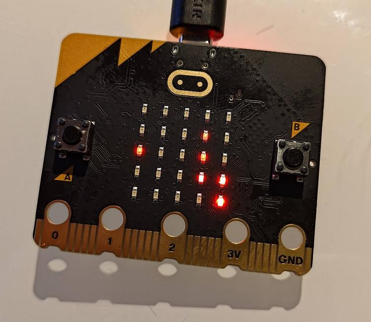

# Snake
Simple implementation of snake.

## Installation
Just upload the `main.py` onto your Micro:bit. This assumes you have *Micropython* already installed on it.

## Game play
* Press `A` and `B` buttons at simultaneously to start a game
* `A` for turning left and `B` for turning right
* When dying, the score is displayed
